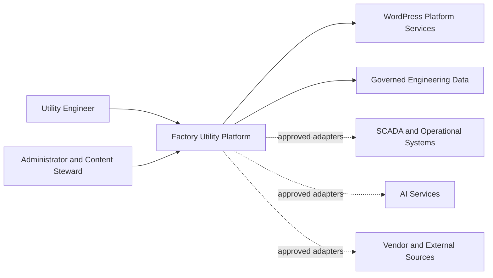

# Architecture

| Field | Value |
|---|---|
| Status | Baseline |
| Version | 0.1.0 |
| Effective date | 2026-08-05 |
| Owner | Chief architect |
| Review cycle | At every material architecture decision |

## Purpose

This document defines the stable architecture model and decision boundaries for the Factory Utility Platform. Detailed implementation designs belong in `03_Development`; durable architecture decisions belong in `decisions/`.

## Architecture Drivers

- Trusted engineering calculations and reference data
- Modular product evolution over a ten-year horizon
- WordPress-first delivery with explicit extension boundaries
- Mobile-first, accessible, secure, performant, and SEO-capable experiences
- Reusable components and shared domain services
- Traceable data, formulas, sources, decisions, and releases
- Future SCADA, energy, carbon, and AI integrations without coupling the core to one provider

## System Context

Dashed connections are future integration boundaries and are not authorized production integrations in Sprint 1.

## Target Architecture Layers

| Layer | Responsibility |
|---|---|
| Experience | Pages, dashboards, responsive views, accessibility, and interaction states |
| Application | Use cases, orchestration, permissions, validation flow, and error handling |
| Domain | Calculations, units, equipment concepts, reference rules, and business invariants |
| Data | WordPress persistence, governed schemas, repositories, provenance, and migrations |
| Integration | Explicit adapters for SCADA, AI, vendor, analytics, and external services |
| Platform | WordPress lifecycle, configuration, security, observability, caching, and deployment |

Dependencies point inward toward stable domain contracts. Domain logic must not depend directly on presentation, WordPress globals, or external providers.

## Module Model

Each product capability is a cohesive module with an explicit public interface. A module owns its feature-specific application flow and presentation while consuming shared domain and platform services. Shared units, validation, source citation, permissions, logging, and UI primitives must not be reimplemented by individual modules.

Initial module families are Dashboard, Calculator, Reference, Trouble Guide, Equipment, Vendor, AI Copilot, SCADA, and Energy and Carbon.

## Data and Trust Boundaries

- Engineering formulas require variables, units, ranges, assumptions, precision, source provenance, and known-answer tests.
- External and operational data enters only through validated adapters.
- Permissions are enforced server-side at every privileged boundary.
- User input is validated and sanitized; output is escaped for its destination context.
- Sensitive plant, personal, authentication, and operational data must not be exposed through logs or public content.
- AI output is advisory unless a separately approved workflow grants operational authority.

## Quality Attributes

Architecture decisions must evaluate maintainability, correctness, security, privacy, accessibility, performance, SEO, resilience, observability, interoperability, and recoverability. Detailed acceptance gates are defined by the dedicated standards documents.

## Decision Governance

A decision requires an ADR when it introduces a durable constraint, changes a system boundary, adds a significant dependency, changes a data contract, affects security or privacy, or creates a migration or compatibility obligation. ADRs are stored in `decisions/` and linked from implementation and release artifacts.

## Architecture Constraints

- No duplicate capability or parallel source of truth.
- No direct provider coupling outside an integration adapter.
- No hidden unit conversion or untraceable engineering rule.
- No material architecture change without an ADR and explicit approval where scope is affected.
- No structural Governance change without a separate approved proposal.

## Current Architecture Status

The governance architecture is approved and frozen. The application architecture is a baseline subject to evidence-based refinement through ADRs. Sprint 1 must define the physical WordPress module structure before production feature implementation.
