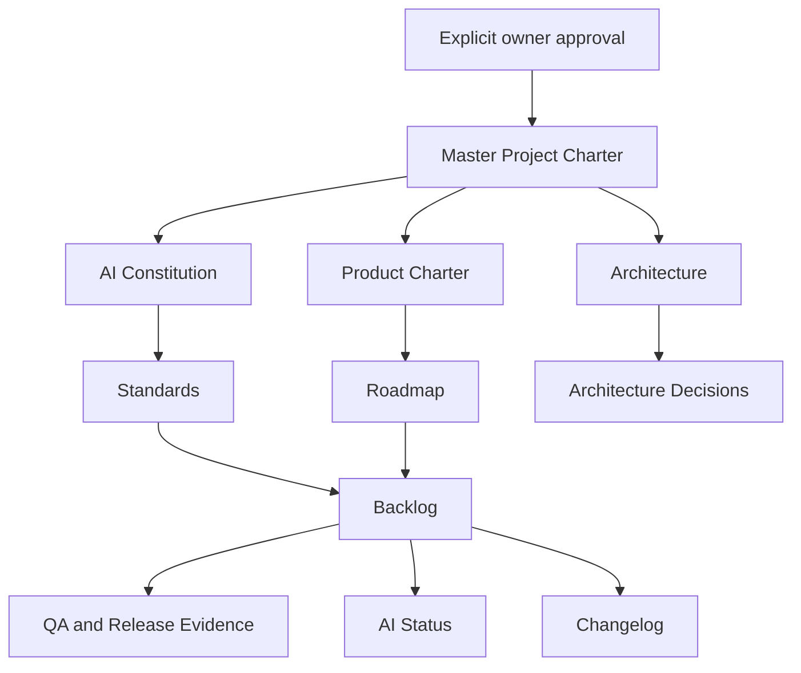

# Governance

| Field | Value |
|---|---|
| Architecture status | Approved and frozen |
| Governance status | Approved |
| Project status | Foundation Complete |
| Next phase | Governance Implementation |
| Effective date | 2026-08-05 |

## Purpose

This directory contains the authoritative governance system for the Factory Utility Platform. It separates durable policy, product direction, architecture, standards, operational registers, decisions, and templates so that each document has one responsibility.

The root [`MASTER_PROJECT_CHARTER.md`](../MASTER_PROJECT_CHARTER.md) is the repository's highest Governance document. Chapters 1 through 16 are approved; the Charter remains a draft constitutional baseline until all Version 1.0 adoption gates pass. The former `PROJECT_CHARTER.md` remains available as Superseded historical context.

## Authority and Document Map

The Master Project Charter is the highest repository document beneath explicit owner authority. The AI Constitution, Product Charter, Architecture, Standards, decisions, operational registers, and historical records derive their authority through the hierarchy defined by the Master Charter.

| Document | Responsibility | Change pattern |
|---|---|---|
| `00_AI_CONSTITUTION.md` | Mandatory AI-assisted operating rules | Constitutional review |
| `03_PRODUCT_CHARTER.md` | Product identity, users, scope, and outcomes | Product governance review |
| `ARCHITECTURE.md` | System boundaries, architecture model, quality attributes, and decision process | Architecture review and ADR |
| `AI_STATUS.md` | Live operational dashboard and next approved action | Updated with material workflow changes |
| `standards/DEVELOPMENT_STANDARD.md` | Software development rules | Standards review |
| `standards/DOCUMENT_STANDARD.md` | Documentation lifecycle and metadata | Standards review |
| `standards/GITHUB_STANDARD.md` | Repository, branch, commit, and pull-request rules | Standards review |
| `standards/RELEASE_STANDARD.md` | Release readiness, deployment, and rollback rules | Standards review |
| `standards/QA_STANDARD.md` | Verification strategy, evidence, and quality gates | Standards review |
| `ROADMAP.md` | Strategic sequencing and phase outcomes | Product planning review |
| `BACKLOG.md` | Approved executable work and acceptance criteria | Continuous operations |
| `CHANGELOG.md` | Notable repository changes | Every material change |
| `decisions/` | Durable architecture decision records | One ADR per material decision |
| `templates/` | Reusable governance artifact templates | Standards review |
| `PROJECT_CHARTER.md` | Superseded legacy project charter retained for historical traceability and backward-compatible references | Historical preservation only |

## Repository Governance Flow

The Master Project Charter is the current constitutional Source of Truth. Its Version 1.0 declaration remains blocked until all adoption gates defined by the Charter are satisfied.

## Frozen Architecture Policy

The directory responsibilities and governance layers documented here are frozen as of 2026-08-05. Future structural changes require a separate written proposal, impact analysis, explicit approval, backlog item, changelog entry, validation evidence, and dedicated pull request before implementation.
