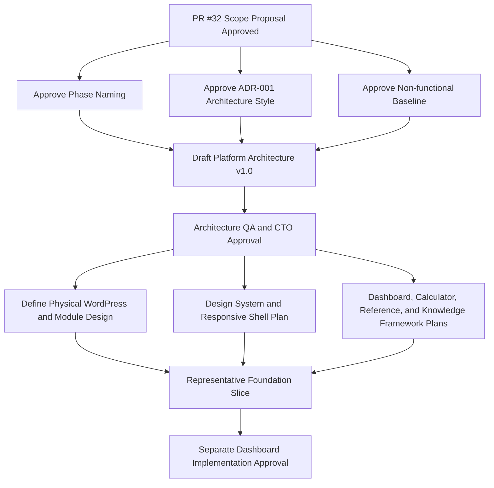

# Platform Architecture v1.0 Readiness Package

| Field | Value |
|---|---|
| Status | Review |
| Version | 0.1.0 |
| Date | 2026-08-06 |
| Backlog | `ARC-003` |
| Owner | Chief architect |
| Prerequisite | Approved [Platform Architecture v1.0 Scope Proposal](PLATFORM_ARCHITECTURE_V1_SCOPE_PROPOSAL.md) |
| Decision authority | CTO review |

## Purpose

Resolve the three decisions required before Platform Architecture v1.0 may be written: operational phase naming, architecture style, and a measurable non-functional baseline. This package also defines the dependency sequence, open decisions, risks, and recommended implementation order.

Approval authorizes preparation of Platform Architecture v1.0 within the approved Scope Proposal. It does not authorize Dashboard code or any excluded implementation.

## Package Contents

1. [Phase Naming Normalization Proposal](../../01_Product/planning/PHASE_NAMING_PROPOSAL.md)
2. [ADR-001 — Platform Architecture Style Proposal](../../00_Governance/decisions/ADR-001_PLATFORM_ARCHITECTURE_STYLE_PROPOSAL.md)
3. [Platform Non-functional Baseline Proposal](NON_FUNCTIONAL_BASELINE_PROPOSAL.md)
4. dependency and decision sequence in this document;
5. risks and open decisions in this document; and
6. recommended implementation order in this document.

## Executive Recommendations

| Decision | Recommendation | Approval effect |
|---|---|---|
| Phase naming | Phase 2 becomes Platform Engineering; Core Engineering Tools becomes Phase 3 within a six-phase operational Roadmap | Removes competing Phase 2 names without constitutional change |
| Architecture style | WordPress-hosted modular monolith with hybrid-ready provider and integration boundaries | Establishes the style for Platform Architecture v1.0; does not authorize code |
| Non-functional baseline | Adopt measurable performance, availability, responsive, accessibility, security, observability, support, and recovery targets | Creates architecture and later QA acceptance budgets before Dashboard work |

## Dependency and Decision Sequence

### Required order

1. approve this Readiness Package as one coherent decision set;
2. activate the normalized Roadmap and ADR-001;
3. write Platform Architecture v1.0 only within the approved Scope Proposal;
4. validate architecture views, module ownership, dependency rules, non-functional mappings, and exclusions;
5. obtain CTO approval for Platform Architecture v1.0;
6. prepare bounded physical design and Product/Design framework plans;
7. validate a separately approved representative foundation slice; and
8. request explicit Dashboard implementation authorization.

Parallel work is permitted only where it does not assume an unapproved upstream decision.

## Decision Boundaries

### Decided by package approval

- the authoritative operational phase taxonomy;
- the initial Platform architecture style;
- the direction of module and WordPress dependencies;
- the rule for future hybrid extraction;
- measurable baseline quality targets; and
- the sequence and approval gates before Dashboard implementation.

### Remains open for Platform Architecture v1.0

- exact module public contracts and dependency matrix;
- physical package boundaries and bootstrap sequence;
- logical persistence ownership, without physical schema;
- server-rendered versus progressively enhanced interaction allocation;
- cache responsibility and invalidation principles;
- search responsibility and indexing boundary;
- configuration and feature-flag principles;
- error taxonomy and degraded-state propagation;
- architecture fitness-test approach; and
- mapping of each non-functional target to architecture mechanisms.

### Requires later dedicated approval

- database schema and migrations;
- API protocols, routes, payloads, and versions;
- authentication and authorization implementation;
- detailed UI and design tokens;
- Calculator formulas and validated domain datasets;
- live SCADA, historian, tag, alarm, or control integration;
- AI model, retrieval implementation, vector store, prompts, tools, or provider;
- production hosting, deployment, CI/CD, backup tooling, and observability provider;
- native mobile or offline application; and
- Dashboard production implementation.

## Risk Register

| ID | Risk | Probability | Impact | Disposition |
|---|---|---:|---:|---|
| AR-01 | Modular boundaries become naming only | Medium | High | Require explicit contracts, ownership, and dependency validation in Platform Architecture v1.0 |
| AR-02 | WordPress globals leak into domain modules | Medium | High | Enforce adapter direction and architecture tests before implementation |
| AR-03 | Shared services accumulate feature logic | Medium | High | Define admission criteria and owner for each shared service |
| AR-04 | Hybrid-ready is misread as authority to deploy services | Medium | High | Require separate extraction ADR; keep all external services unauthorized |
| AR-05 | Non-functional targets are adopted without measurement capability | Medium | Medium | Require owner, tool/method, environment, and QA mapping in Platform Architecture v1.0 |
| AR-06 | Performance budgets conflict with visualization needs | Medium | Medium | Treat heavy visualization as route-level exception with accessible fallback and evidence |
| AR-07 | Availability or recovery targets exceed approved hosting capability | Unknown | High | Validate during production-environment architecture before Release |
| AR-08 | Phase renaming confuses historical evidence | Low | Medium | Preserve dated records and normalize only current operational planning |
| AR-09 | Dashboard pressure bypasses architecture approval | High | High | Maintain explicit Backlog and CTO gates; no Dashboard code in this package |
| AR-10 | SCADA or AI concepts contaminate the MVP | Medium | High | Allow ports and trust boundaries only; prohibit providers and live connections |

## Open Decisions

| Decision | Owner | Required by | Blocking |
|---|---|---|---|
| Approve normalized six-phase Roadmap | Product owner / CTO | Readiness Package merge | Platform Architecture planning status |
| Approve ADR-001 recommendation | CTO / Chief architect | Before Platform Architecture v1.0 | Architecture style |
| Approve non-functional targets | CTO with QA/Security/Accessibility input | Before Platform Architecture v1.0 completion | Architecture acceptance and Dashboard readiness |
| Select exact WordPress package layout | Chief architect | Physical design after Platform Architecture v1.0 | Code scaffolding |
| Define expected workload and hosting assumptions | Product/Operations/Architecture | Before production environment design | Load, availability, and recovery validation |
| Define data classification and authorization model | Security/Product | Before authentication or sensitive data implementation | Access implementation |

## Recommended Implementation Order

The following is a planning order, not implementation authorization:

1. **Platform Architecture v1.0** — refine approved views, modules, contracts, trust zones, and NFR mappings.
2. **Architecture fitness rules** — define dependency and WordPress-boundary validation.
3. **Physical WordPress module design** — package layout, bootstrap, adapters, and ownership without Product features.
4. **Design System and Experience Shell plan** — responsive structure, navigation, states, and accessibility behavior.
5. **Shared service contracts** — units, provenance, validation state, identity context, observability, and configuration.
6. **Framework specifications** — Dashboard composition, Calculator entry, Reference entry, Knowledge navigation.
7. **Representative foundation slice** — separately approved fixture-backed path validating architecture and NFR measurement.
8. **Dashboard implementation proposal** — only after all upstream approvals and evidence exist.

Live SCADA and AI integration remain later dedicated work regardless of interface readiness.

## Readiness Validation

The package is ready for CTO review only when:

- all three decision proposals are complete, mutually consistent, and linked;
- the Roadmap has one proposed authoritative phase taxonomy;
- ADR-001 evaluates all three requested architecture styles and records one recommendation;
- module, shared-service, deployment, WordPress, API, SCADA, maintainability, and migration boundaries are addressed;
- all eight requested non-functional categories have measurable targets;
- dependency order prevents Dashboard work from preceding architecture approval;
- risks and open decisions have owners or disposition paths;
- no Platform Architecture v1.0 document or Dashboard code is created;
- relative links and Mermaid syntax validate;
- `ARC-002` approval and `ARC-003` Review state are recorded; and
- Master Project Charter and frozen Governance Architecture remain unchanged.

## Definition of Done

This Readiness Package task is complete only after:

1. CTO approves the three decisions as one package or records bounded required changes;
2. the Draft PR is merged;
3. phase naming, ADR, and non-functional documents become Active;
4. `ARC-003` is marked Done with QA and approval evidence;
5. AI Status and Changelog identify Platform Architecture v1.0 as the next authorized deliverable; and
6. no Dashboard implementation has begun.

## Approval Request

Approve:

1. the six-phase normalized operational Roadmap;
2. ADR-001's WordPress-hosted modular-monolith decision with hybrid-ready boundaries;
3. the measurable non-functional baseline; and
4. the dependency sequence and implementation gates in this package.

Until approval, all package decisions remain proposed and Platform Architecture v1.0 remains blocked.
