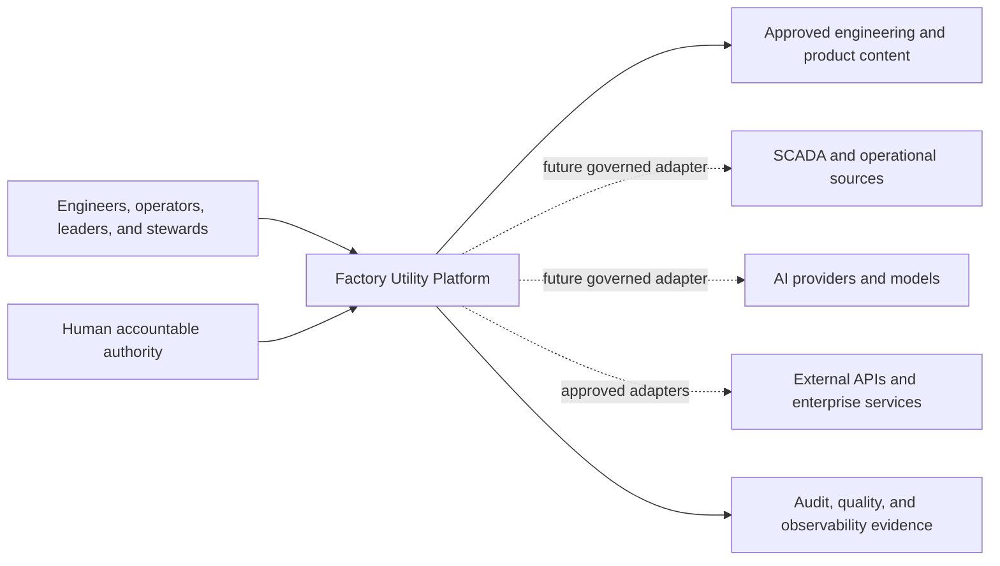
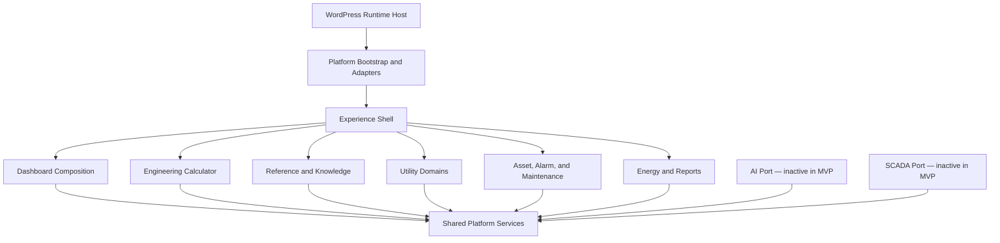
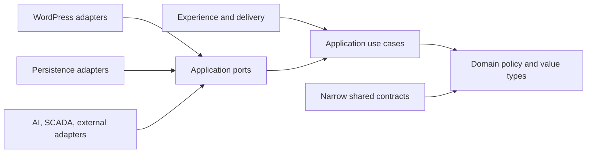
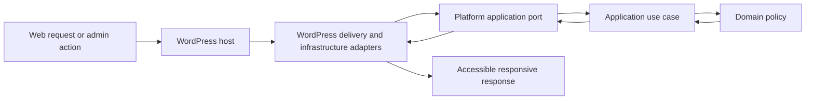
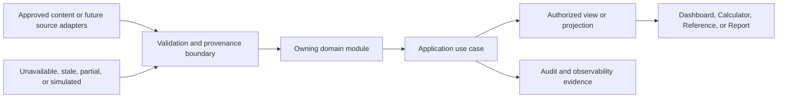
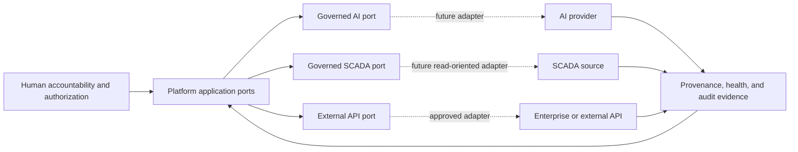
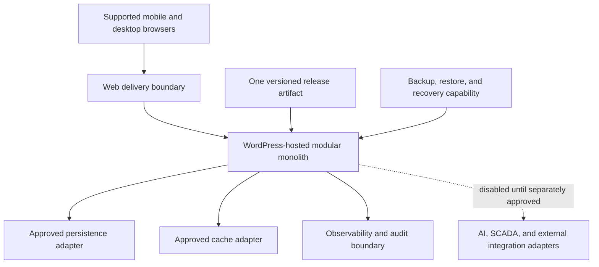
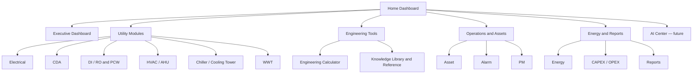

# Platform Architecture v1.0

| Field | Value |
|---|---|
| Status | Review |
| Version | 1.0.0-rc.1 |
| Date | 2026-08-06 |
| Backlog | `ARC-004` |
| Owner | Chief architect |
| Scope authority | [Platform Architecture v1.0 Scope Proposal](PLATFORM_ARCHITECTURE_V1_SCOPE_PROPOSAL.md) |
| Style decision | [ADR-001 — Platform Architecture Style](../../00_Governance/decisions/ADR-001_PLATFORM_ARCHITECTURE_STYLE_PROPOSAL.md) |
| Quality baseline | [Platform Non-functional Baseline](NON_FUNCTIONAL_BASELINE_PROPOSAL.md) |

## 1. Purpose and Authority

This document defines the logical architecture for a long-lived engineering Platform that supports Dashboard, Calculator, Reference, Knowledge, Asset, Energy, Reports, and future governed AI and SCADA capabilities. It translates the constitutional and Product direction into enforceable module, dependency, data, integration, deployment, and quality boundaries.

The approved architecture style is a **WordPress-hosted modular monolith with hybrid-ready adapter boundaries**. WordPress is the initial runtime host and an adapter boundary; it does not own core domain or application logic. This document authorizes architecture definition only. It does not authorize Dashboard production code, live SCADA connectivity, AI model integration, authentication implementation, database schema, or production deployment.

## 2. Architecture Principles

1. Dependencies point toward domain policy, never toward WordPress globals or external providers.
2. Each module owns one cohesive capability and exposes an explicit application contract.
3. Shared services contain only genuinely cross-cutting policy; they shall not become a miscellaneous feature layer.
4. Data state, source, freshness, validation, unit, and access context remain visible across boundaries.
5. AI, SCADA, and external providers are optional adapters whose failure shall not collapse core navigation, Reference, or Calculator entry paths.
6. One deployable monolith is the default. Separation requires an ADR supported by security, reliability, scale, or operational evidence.
7. Accessibility, responsive behavior, security, observability, performance, and recovery are architectural qualities, not later decoration.

## 3. Platform Context

The Platform serves utility engineers, engineering leaders, operators, maintenance and reliability teams, energy and sustainability teams, and governed content administrators. It provides one experience over approved engineering content and future operational context while preserving accountable boundaries with external systems.

## 4. Module Boundaries and Responsibilities

| Module | Owns | Does not own |
|---|---|---|
| Experience Shell | navigation, page composition, responsive regions, status presentation | domain calculations or provider calls |
| Dashboard Composition | governed dashboard views, widget contracts, empty/stale/error states | utility-domain rules or direct source access |
| Utility Domains | Electrical, CDA, DI/RO, PCW, HVAC/AHU, Chiller/Cooling Tower, and WWT concepts | global navigation or integration transport |
| Engineering Calculator | calculation definitions, input/output semantics, units, validation, result provenance | formulas in this architecture document or UI shell |
| Reference and Knowledge | governed reference, citations, taxonomy, revision and relationships | AI inference or source-system administration |
| Asset, Alarm, and Maintenance | asset context, alarm meaning, PM and lifecycle relationships | live alarm ingestion or maintenance execution |
| Energy and Reports | energy, carbon, CAPEX/OPEX, aggregation and report semantics | deployment or provider-specific acquisition |
| AI Boundary | governed AI use-case ports, evidence and human-accountability constraints | model choice, prompts, or model execution in MVP |
| SCADA Boundary | operational-data ports, freshness and quality contracts | live connection, control, or protocol implementation |
| Platform Services | approved cross-cutting contracts listed below | feature-specific business policy |
| WordPress Adapters | host lifecycle, routing, persistence, content, administration, cache and identity integration | core domain decisions |

### Modular Monolith Structure

## 5. Dependency Direction

The Experience layer invokes application use cases. Application services coordinate domain policy through ports. Domain code depends only on language-level abstractions and its own value types. Adapters implement outward-facing ports. WordPress, storage, AI, SCADA, and external APIs may depend on application contracts; application and domain layers shall not depend on those implementations.

Prohibited dependency paths include domain-to-WordPress globals, module-to-provider SDK, feature-to-feature persistence access, and presentation-to-source-system access. Cross-module collaboration occurs through application contracts or published immutable events, not internal tables or classes.

## 6. WordPress Host and Adapter Boundary

WordPress provides runtime bootstrapping, request delivery, approved content administration, persistence integration, cache integration, scheduled host events, and identity/access context when those capabilities are implemented. Platform adapters translate WordPress concepts into application ports. Themes render presentation and shall not contain domain rules.

No module may call WordPress globals from its domain layer. Bootstrap code is the composition root where adapters are selected and dependencies assembled. Replacement of the host or a specific adapter shall not require rewriting domain policy.

## 7. Shared Platform Services

Shared services are versioned contracts with explicit owners:

- measurement, units, rounding, locale, and engineering quantity semantics;
- provenance, citation, revision, validation status, and freshness metadata;
- identity and access context contracts without prescribing an authentication implementation;
- search and discovery contracts across authorized content;
- observability, audit, correlation, and privacy-safe diagnostic context;
- configuration, feature-state, cache, and time abstractions; and
- design tokens, accessibility semantics, and reusable experience primitives.

A capability belongs in a feature module unless at least two independent modules require the same stable policy. Shared services shall not own feature workflows or become a bypass around module contracts.

## 8. Data Ownership and Flow

Each record has one authoritative owning module. Other modules consume published contracts or projections and shall not mutate another module's private state. Every engineering or operational value carries sufficient context to distinguish approved, draft, stale, unavailable, simulated, and future live states.

| Information | Authoritative owner | Required boundary metadata |
|---|---|---|
| navigation and composition | Experience Shell / Dashboard Composition | version, visibility, status |
| engineering definitions and results | Calculator or Utility Domain | units, source, validation, revision |
| references and knowledge | Reference and Knowledge | citation, owner, approval, effective date |
| asset and maintenance context | Asset, Alarm, and Maintenance | asset identity, source, freshness, state |
| energy and reporting context | Energy and Reports | period, unit, source, aggregation status |
| future operational observations | source adapter with owning domain contract | timestamp, quality, freshness, source, read/control classification |
| future AI output | AI Boundary | model/provider context, evidence, confidence limits, human status |

This logical flow does not select a database, schema, message broker, protocol, or API format.

## 9. Security and Access Boundaries

The architecture distinguishes public/reference, authenticated engineering, operational-data, administration, and integration trust zones. Authorization is evaluated at application use-case boundaries and reinforced by adapters; hiding a UI element is not authorization. Least privilege, deny-by-default integration access, input validation, output encoding, secret isolation, auditability, data minimization, and safe failure are mandatory design constraints.

High-consequence operational and alarm capabilities require a separate threat model, strengthened availability and recovery baseline, explicit human accountability, and Release approval before implementation. The MVP defines access contracts and data classifications only; it does not implement authentication or access configuration.

## 10. AI, SCADA, and External API Adapter Boundaries

AI and SCADA are independent external trust boundaries. They shall not share provider code, credentials, persistence, or authorization assumptions. External adapters translate provider-specific representations into stable Platform contracts and expose health, provenance, freshness, failure, and audit information.

The MVP contains inactive ports or documented seams only. It performs no AI inference, live operational ingestion, alarm actuation, write-back, or control. Any future control path requires a separate architecture, safety, security, authority, and Release decision.

## 11. Deployment Concept

The initial deployment is one WordPress-hosted Platform application with one versioned release boundary. Logical modules remain independently testable inside that deployment. Persistence, cache, object storage, observability, and external-provider concerns are reached only through adapters. Environments and provider products are intentionally not selected here.

An adapter or module may become a separate service only through an approved ADR showing that separation improves security, reliability, scaling, or operations enough to justify distributed-system cost.

## 12. Observability and Recovery Architecture

All delivery, application, adapter, and module boundaries emit privacy-safe correlation, failure classification, latency, dependency health, and lifecycle evidence through provider-independent observability contracts. User-visible state shall distinguish unavailable, stale, partial, and simulated information. Optional integrations fail closed or degrade without making trusted content appear current.

The approved initial targets are monthly availability of at least 99.5%, RTO of 4 hours, and RPO of 24 hours. These are architecture baselines, not achieved service evidence. They shall be reviewed and strengthened before live SCADA, production operational-data ingestion, high-consequence alarms, or enterprise service commitments. Recovery design must cover configuration, content, persistent state, release artifact, restoration verification, and evidence retention.

## 13. Responsive and Accessibility Architecture

The Experience Shell uses semantic, progressively enhanced, mobile-first rendering. Navigation, content hierarchy, data status, and primary actions remain available without assuming wide screens, hover, color perception, or precise pointer input. Modules consume common design and accessibility primitives rather than implementing competing shells.

WCAG 2.2 Level AA is the target. Architecture acceptance includes keyboard operation, focus management, semantic landmarks, accessible names and states, error association, contrast, zoom/reflow, non-color status meaning, and textual or tabular alternatives for charts. The supported responsive range and measurable budgets remain governed by the active Non-functional Baseline.

## 14. MVP Architecture

The first MVP architecture is limited to:

1. Home Dashboard composition using approved fixture or governed content;
2. utility-module navigation for the approved initial module catalog;
3. Engineering Calculator entry without formulas;
4. Engineering Reference entry without a detailed content schema;
5. responsive and accessible web layout contracts;
6. WordPress host integration through adapters; and
7. inactive, testable seams for future AI and SCADA expansion.

The MVP proves dependency direction, module composition, state presentation, responsive behavior, accessibility, and replaceable adapters. It does not create production Dashboard code under this approval.

## 15. User Navigation Structure

Navigation is an information architecture contract, not a detailed UI design. Visibility may vary by authorization and module readiness while stable destinations and status meaning remain consistent.

## 16. Architecture Risks and Open Decisions

| ID | Risk or open decision | Architectural response | Required next decision |
|---|---|---|---|
| AR-01 | WordPress coupling enters domain logic | composition root, ports, adapter tests, dependency checks | physical package architecture |
| AR-02 | Shared services become a dumping ground | ownership and cross-module admission rule | shared-contract catalog |
| AR-03 | Dashboard composition bypasses module ownership | read contracts and authorized projections | dashboard/widget framework architecture |
| AR-04 | Engineering values lose units or provenance | mandatory measurement and provenance contracts | domain data standards |
| AR-05 | Future SCADA data appears live or trusted incorrectly | explicit quality, freshness, simulated and unavailable states | separate SCADA architecture before connection |
| AR-06 | AI output is mistaken for engineering authority | evidence, disclosure, permission and human-accountability boundary | separate AI architecture before model integration |
| AR-07 | Initial recovery targets are insufficient for operational use | conditional strengthening gates | operations review before listed trigger events |
| AR-08 | One deployable creates future scaling pressure | measured extraction path through ADR | hosting/workload evidence |
| AR-09 | Access assumptions leak across modules | use-case authorization and trust-zone contracts | identity and access architecture |
| AR-10 | Browser data visualization harms accessibility/performance | shared accessible visualization contract and budgets | design-system architecture |

Open implementation decisions deliberately deferred include physical namespace/package layout, persistence technology and schema, identity provider, cache and observability products, API transports, SCADA protocols, AI providers and models, hosting topology, detailed UI, and deployment automation.

## 17. Architecture Validation Criteria

Platform Architecture v1.0 is ready for approval when all of the following pass:

- all approved Scope Proposal topics and eight required views are present;
- module ownership and public collaboration boundaries are unambiguous;
- dependency direction keeps domain and application logic independent of WordPress globals and provider SDKs;
- WordPress, AI, SCADA, external API, persistence, and observability concerns are represented as adapters;
- information ownership, provenance, units, freshness, validation, and failure states remain traceable;
- security zones and authorization evaluation points are explicit without implementing authentication;
- deployment remains a modular monolith and future separation requires evidence and an ADR;
- WCAG 2.2 AA, responsiveness, performance, availability, observability, and recovery baselines are architecturally addressed;
- the conditional review gates for availability, RTO, and RPO are explicit;
- MVP scope and exclusions are explicit;
- repository links, Markdown, Mermaid syntax, and terminology validate;
- no production Dashboard code, live AI/SCADA integration, database schema, API implementation, or Governance Architecture change is introduced; and
- independent QA and CTO review evidence exists before the document becomes Active.

## 18. Approval Effect and Next Gate

Approval establishes the logical Platform Architecture v1.0 baseline and permits separate proposals for physical WordPress/module design, the design-system foundation, framework architectures, and a representative fixture-based foundation slice. It does not itself authorize Dashboard production implementation, live integration, production deployment, or any excluded decision.
