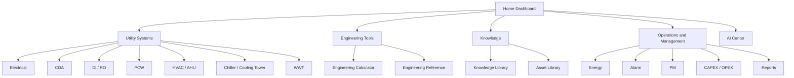
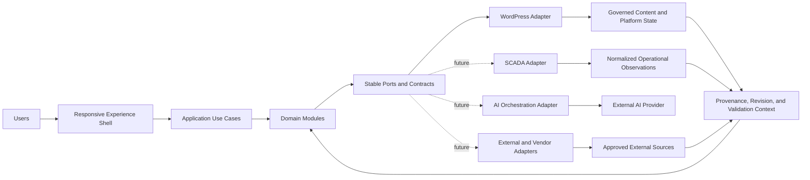
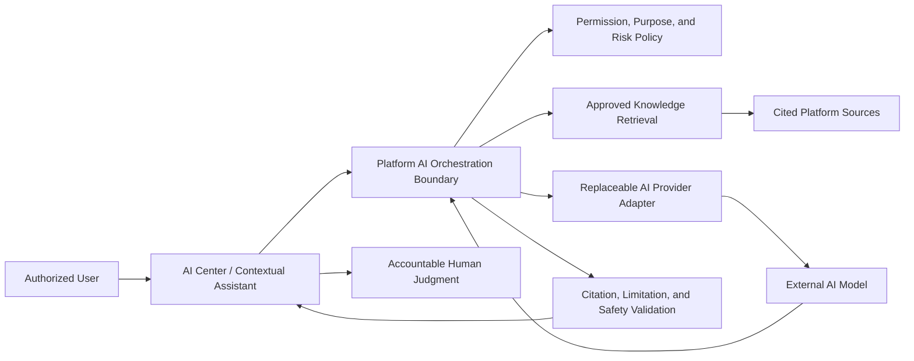
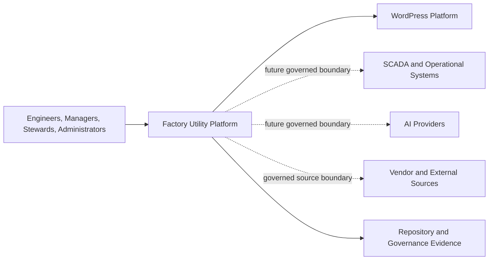
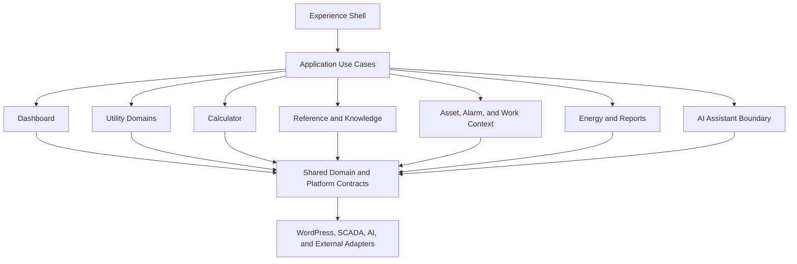
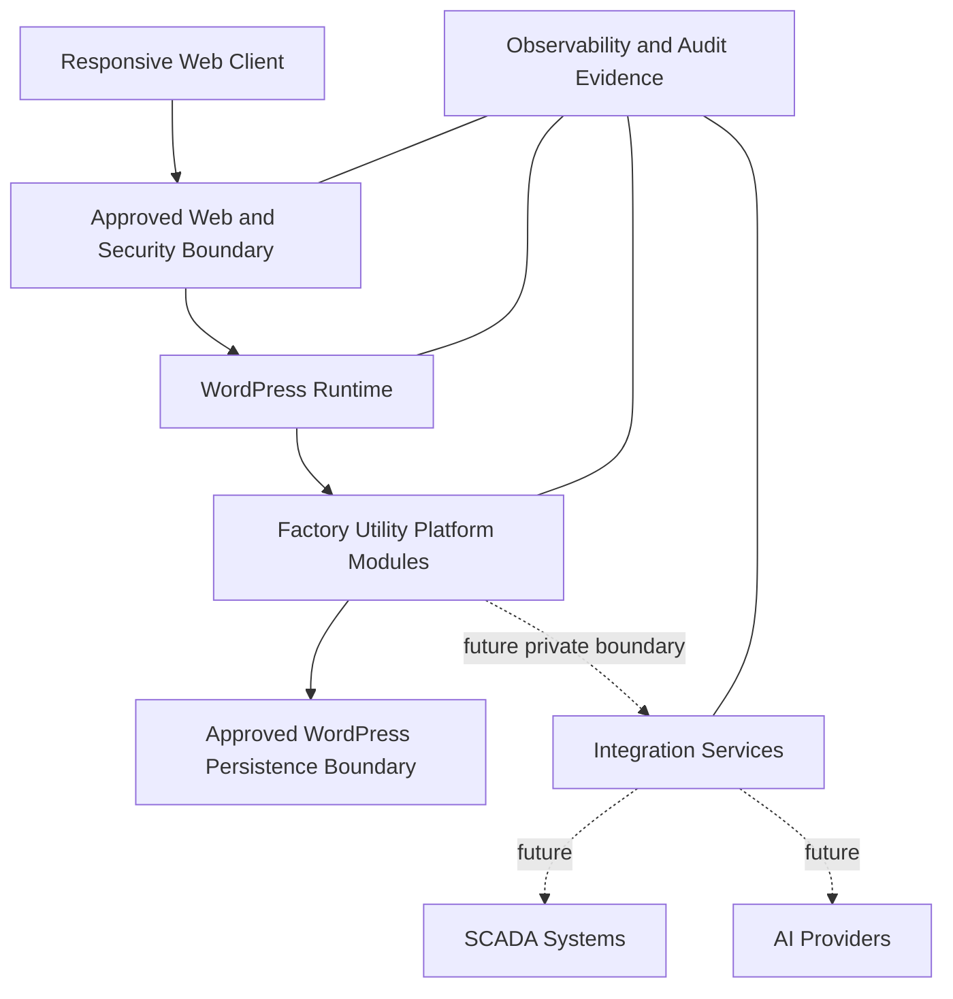

# Platform Architecture v1.0 Scope Proposal

| Field | Value |
|---|---|
| Status | Review |
| Version | 0.1.0 |
| Date | 2026-08-06 |
| Backlog | `ARC-002` |
| Owner | Chief architect |
| Scope | Architecture definition only; no Dashboard or Platform implementation |
| Authority | [Master Project Charter](../../MASTER_PROJECT_CHARTER.md), [Product Charter](../../00_Governance/03_PRODUCT_CHARTER.md), and [Architecture baseline](../../00_Governance/ARCHITECTURE.md) |

## Executive Decision Requested

Approve the boundaries, views, responsibilities, MVP priorities, risks, and validation gates that shall govern preparation of Platform Architecture v1.0. Approval of this proposal authorizes architecture definition only. It does not authorize Dashboard implementation, a live integration, a schema, an API, production deployment, authentication implementation, detailed UI design, calculator formulas, or a native mobile application.

## 1. Product Purpose

Factory Utility Platform is a long-term engineering product for semiconductor and industrial utility professionals. Its architecture shall turn governed engineering knowledge, calculation capability, asset context, operational information, and accountable assistance into one coherent Platform rather than a collection of unrelated pages or tools.

Platform Architecture v1.0 shall define stable responsibility boundaries that allow the Product to begin with a WordPress-integrated responsive MVP and later expand into operational, AI-assisted, energy, asset, and reporting capabilities without replacing the core domain model or duplicating shared services.

## 2. User Groups

| User group | Primary outcomes | Architectural concern |
|---|---|---|
| Utility engineers | Navigate utility domains, use trusted calculations and references, investigate system conditions | Fast contextual access, engineering traceability, mobile usability |
| Operations engineers | Understand current and historical utility context and alarms | Read-only expansion boundary, freshness and degraded-state visibility |
| Maintenance and reliability engineers | Connect assets, preventive maintenance, alarms, and knowledge | Stable asset identity and cross-module relationships |
| Energy and sustainability engineers | Analyze energy, cost, efficiency, and carbon context | Governed aggregation, units, baselines, and provenance |
| Engineering managers and executives | Review performance, risk, CAPEX/OPEX, and portfolio summaries | Role-appropriate aggregation without hiding source context |
| Content and knowledge stewards | Maintain approved reference and knowledge material | Lifecycle, ownership, revision, citation, and discoverability |
| Platform administrators | Operate WordPress integration and Platform configuration | Least privilege, separation of configuration and domain truth |
| Future AI-assisted users | Ask bounded questions and receive cited advisory assistance | Retrieval authority, permission filtering, uncertainty, human accountability |

User groups define needs, not authentication roles. Authentication and authorization implementation requires separate approval.

## 3. Platform Boundaries

### In scope for architecture definition

- the Platform context and responsibility model;
- module boundaries and dependency direction;
- user navigation and information organization;
- conceptual data movement and trust boundaries;
- replaceable boundaries for WordPress, AI, SCADA, analytics, and external sources;
- responsive web, accessibility, security, observability, performance, SEO, and continuity requirements;
- the MVP architecture slice and future expansion seams; and
- architecture validation and follow-on decision requirements.

### Outside the Platform core

- field controllers, programmable logic controllers, distributed control systems, historians, and SCADA ownership;
- third-party AI models and provider infrastructure;
- vendor-owned systems and content authority;
- corporate identity providers and enterprise security administration;
- native mobile operating-system applications; and
- production hosting, networking, backup, and deployment services until separately approved.

External systems may exchange information only through explicit adapters and governed contracts. They do not become the constitutional or engineering Source of Truth merely by integration.

## 4. Core Modules

Platform Architecture v1.0 shall evaluate the following cohesive module families:

1. **Experience Shell** — global navigation, responsive layout, shared page states, context, and composition.
2. **Dashboard** — governed overview and utility-domain presentation composed from registered modules.
3. **Utility Domains** — Electrical, CDA, DI/RO, PCW, HVAC/AHU, Chiller/Cooling Tower, and WWT contexts.
4. **Engineering Calculator** — discoverable calculation capability with future governed definitions and execution.
5. **Engineering Reference** — structured, cited engineering reference entry and retrieval.
6. **Knowledge Platform** — governed knowledge organization, relationships, lifecycle, and discovery across modules.
7. **Asset Management** — equipment identity, classification, context, maintenance relationships, and lifecycle boundary.
8. **Alarm and Work Context** — future alarm, preventive-maintenance, and action context without controlling plant equipment.
9. **Energy Management** — energy, cost, efficiency, and carbon-analysis boundary.
10. **Reports** — governed presentation and export boundary for traceable summaries.
11. **AI Assistant / AI Center** — advisory assistance boundary over approved, permission-filtered Platform knowledge.
12. **SCADA Integration** — future read-oriented operational-data adapter and normalization boundary.
13. **WordPress Platform Adapter** — content, routing, extension lifecycle, administration, and persistence integration.
14. **Shared Platform Services** — identity context, permissions contracts, units, provenance, validation, search, observability, caching, and design primitives.

Initial Dashboard labels are navigation and composition targets, not permission to build independent silos. Executive Dashboard, Energy, Asset, Alarm, PM, CAPEX/OPEX, Reports, AI Center, Engineering Calculator, and Knowledge Library shall reuse the responsible module family rather than duplicate domain logic.

## 5. Module Responsibilities

| Module | Owns | Shall not own |
|---|---|---|
| Experience Shell | Navigation composition, responsive regions, shared interaction states | Engineering rules, operational truth, module-specific persistence |
| Dashboard | Page composition, widget registration contract, summary context | Source-system acquisition, calculation formulas, duplicated module records |
| Utility Domains | Domain vocabulary, domain-specific views and relationships | Shared units, global navigation, provider clients |
| Calculator | Calculation discovery and future execution boundary | Reference publishing, SCADA acquisition, dashboard composition |
| Reference | Governed reference content and citations | Informal AI memory, asset telemetry, calculation execution |
| Knowledge Platform | Taxonomy, relationships, discovery, knowledge lifecycle | A competing document authority or ungoverned generated truth |
| Asset Management | Asset identity and lifecycle relationships | SCADA protocol handling, PM workflow implementation in this scope |
| Alarm and Work Context | Relationships among alarms, assets, knowledge, and future work context | Alarm control, acknowledgement, scheduling, or live workflow in MVP |
| Energy Management | Energy and carbon analytical concepts and aggregation boundary | Raw protocol acquisition or untraceable unit conversion |
| Reports | Traceable report definitions and presentation boundary | Independent copies of source data or approval authority |
| AI Assistant | Bounded orchestration of approved retrieval and advisory responses | Constitutional authority, autonomous plant control, uncited Engineering Truth |
| SCADA Integration | Connection adapters, normalization boundary, freshness and quality context | Plant control ownership, UI logic, domain rules |
| WordPress Adapter | WordPress lifecycle, routing, content bridge, approved persistence boundary | Core domain invariants or direct external-provider coupling |
| Shared Services | Cross-cutting contracts used consistently by modules | Feature-specific workflows or a universal miscellaneous layer |

## 6. Information Architecture

The information architecture shall organize the Product by user intent and utility context rather than by implementation technology.

Every destination shall retain enough context for users to understand the utility domain, information state, source, freshness where applicable, and available next actions. Navigation labels shall remain stable while implementations behind them evolve.

## 7. Data Flow

Platform Architecture v1.0 shall define conceptual flows without selecting a schema or API.

Key rules:

- presentation shall request application use cases rather than query providers directly;
- domain rules shall remain independent of WordPress globals and external provider formats;
- every external datum shall cross validation, normalization, provenance, and permission boundaries before use;
- derived values shall retain their input, method, units, time context, and quality state; and
- reports, dashboards, and AI responses shall reference governed sources rather than maintain parallel truth.

## 8. Integration Boundaries

Every integration shall be represented by a stable Platform-owned port and a replaceable provider adapter. The architecture definition shall identify:

- responsibility and accountable owner;
- inbound and outbound information categories;
- authority and trust level;
- validation, normalization, provenance, freshness, and error states;
- permission and confidentiality rules;
- rate, availability, timeout, retry, degradation, and recovery expectations;
- observability and audit evidence; and
- substitution and retirement strategy.

Direct provider calls from user-interface or domain modules shall be prohibited. Detailed contracts and protocols require subsequent ADRs and implementation designs.

## 9. AI Architecture Boundary

The AI boundary shall:

- remain advisory in the MVP and have no plant-control authority;
- retrieve only approved and permission-eligible knowledge;
- identify source, uncertainty, limitations, model involvement, and required human judgment;
- separate retrieval, orchestration, provider adapters, evaluation, and user presentation;
- prevent provider output from becoming stored Engineering Truth without governed validation;
- support auditability, evaluation, stop, fallback, and provider replacement; and
- comply with Master Charter Chapter 7.

AI model selection, prompts, tool execution, vector stores, model APIs, and production evaluation are explicitly excluded.

## 10. SCADA Integration Boundary

```mermaid
flowchart LR
    PLANT["Plant Control and SCADA Systems"] --> GATE["Approved Read-Oriented Integration Gateway"]
    GATE --> ADAPTER["SCADA Provider Adapter"]
    ADAPTER --> NORM["Normalization and Quality Boundary"]
    NORM --> OBS["Platform Operational Observation Contract"]
    OBS --> DOMAIN["Utility and Energy Modules"]
    DOMAIN --> DASH["Dashboard and Reports"]

    CTRL["Control / Write Command"] -. prohibited in this scope .-> PLANT
```

The SCADA boundary shall be designed for future read-oriented expansion. It shall separate operational systems from the public and WordPress-facing experience, preserve timestamps, source identity, units, quality flags, freshness, gaps, and aggregation context, and fail visibly when data is stale or unavailable.

No live connection, historian choice, protocol, tag model, control command, alarm acknowledgement, network topology, or operational acceptance is authorized. Any future write or control path requires separate high-consequence architecture, security, safety, validation, and owner approval.

## 11. WordPress Boundary

WordPress is the initial delivery platform and shall provide approved content-management, routing, administrative, extension-lifecycle, and persistence capabilities through a contained Platform adapter.

Platform Architecture v1.0 shall determine the conceptual separation among:

- a minimal WordPress theme or presentation host;
- one or more cohesive Platform plugins/modules;
- domain and application code independent of WordPress globals;
- WordPress content and metadata used through repositories or service ports;
- REST or server-rendered interaction boundaries without selecting endpoint details;
- asset loading, caching, localization, SEO, and accessibility responsibilities; and
- upgrade, compatibility, migration, and replacement seams.

The architecture shall not treat WordPress posts, taxonomies, options, or tables as domain architecture by default. Database schema, custom post types, REST endpoints, hooks, plugin packaging, and production deployment remain separate design decisions.

## 12. Mobile and Responsive Boundary

The MVP is a responsive web Product, not a native mobile application. Architecture shall support one semantic information model across mobile, tablet, desktop, and field contexts.

Requirements include:

- mobile-first composition and progressive enhancement;
- WCAG 2.2 AA target, keyboard operation, semantic landmarks, and assistive-technology compatibility;
- navigation that remains usable with touch, limited width, glare, gloves, and intermittent attention;
- density controls and progressive disclosure that do not remove engineering context;
- responsive tables, charts, filters, and status presentation without horizontal assumptions;
- defined loading, empty, stale, unavailable, error, permission, and success states; and
- performance budgets suitable for constrained field networks.

Offline mode, push notifications, device sensors, and native applications are not included.

## 13. Security and Access Boundary

Architecture shall define trust zones and authorization contracts even though authentication implementation is excluded.

- all privileged decisions shall be enforced server-side;
- least privilege, deny-by-default, separation of duties, and auditable access shall guide later role design;
- public knowledge, internal engineering content, operational data, plant-sensitive information, personal data, and administrative configuration shall remain distinguishable;
- input validation, output escaping, nonce or request-integrity controls, prepared data access, and safe error handling shall apply at WordPress boundaries;
- AI and SCADA integrations shall receive only the minimum data and authority required;
- secrets shall remain outside source and content records;
- cache, export, logging, analytics, and search shall respect the same access boundary as the source; and
- security degradation shall fail safely and visibly.

Identity provider selection, user registration, role matrices, single sign-on, multifactor authentication, and access configuration are excluded.

## 14. Non-functional Requirements

Platform Architecture v1.0 shall define measurable acceptance approaches for:

| Quality attribute | Architectural expectation |
|---|---|
| Maintainability | Cohesive modules, stable ports, explicit ownership, low provider coupling |
| Correctness | Domain invariants, units, provenance, validation, and explicit failure states |
| Security and privacy | Least privilege, trust boundaries, data minimization, safe logging and caching |
| Accessibility | WCAG 2.2 AA target and semantic, keyboard-operable responsive experiences |
| Performance | Budgeted page weight, interaction latency, server work, caching, and query behavior |
| Reliability | Predictable degradation, timeouts, retries where safe, idempotency where relevant |
| Observability | Structured events, correlation, health evidence, auditability, privacy-safe diagnostics |
| Scalability | Growth by module and workload without shared-state coupling or premature distribution |
| Interoperability | Platform-owned contracts and replaceable adapters |
| SEO | Server-readable navigation and governed public content metadata where applicable |
| Recoverability | Versioned change, backup-aware migration design, rollback and reconstruction evidence |
| Portability | WordPress and provider integration behind boundaries; domain knowledge remains portable |

Numerical budgets and service objectives shall be proposed during Platform Architecture v1.0 definition and approved before implementation where relevant.

## 15. MVP Scope

The first MVP architecture shall support only:

1. **Home Dashboard** — a responsive shell with governed composition and representative static or approved fixture content;
2. **Utility Module Navigation** — entry points for the initial utility domains without live operational functions;
3. **Engineering Calculator Entry** — discovery and navigation into a future Calculator framework, without formulas;
4. **Reference Entry** — discovery and navigation into governed Reference content;
5. **Responsive Web Layout** — shared mobile-first shell, navigation, and page-state model;
6. **WordPress Integration** — a bounded integration concept suitable for later plugin/theme design; and
7. **Future SCADA and AI Readiness** — ports and trust boundaries only, with no provider connection.

The MVP shall validate one vertical architecture path from WordPress request through the Experience Shell and an application use case to governed content or approved fixture data. It shall not simulate live plant truth or AI capability in a way that could be mistaken for production integration.

## 16. Explicit Exclusions

This proposal and the architecture work it may authorize shall not implement or finalize:

- SCADA live connection, historian integration, protocols, tags, control, or alarm acknowledgement;
- AI model, prompt, tool, agent, vector store, or provider integration;
- database schema, custom tables, migrations, or content-type schema;
- API code, endpoint definitions, webhooks, or integration payload schemas;
- WordPress production deployment, hosting, infrastructure, or environment configuration;
- authentication, identity provider, user-registration, or role-management system;
- detailed visual UI design, final design tokens, screens, or production widgets;
- calculator formulas, validated engineering datasets, or formula execution;
- native mobile application, offline application, or device integration;
- Dashboard implementation or production content;
- production monitoring, release automation, or CI/CD; and
- changes to the frozen Governance Architecture.

Each exclusion requires a separately approved architecture or implementation backlog item with proportionate QA evidence.

## 17. Architecture Risks

| Risk | Consequence | Required architectural response |
|---|---|---|
| Dashboard-first coupling | UI composition becomes the domain model | Define module ownership and application ports before widgets |
| WordPress leakage | Domain logic becomes inseparable from platform globals | Use repositories/adapters and inward dependency direction |
| Utility-module duplication | Units, assets, alarms, and status logic diverge | Establish shared contracts with bounded domain extensions |
| Premature universal model | Different utility domains are forced into incorrect abstractions | Reuse only proven shared meaning; allow cohesive specialization |
| SCADA treated as ordinary web data | Safety, freshness, quality, and network risks are hidden | Maintain a distinct read-oriented operational trust boundary |
| AI authority drift | Generated output appears as verified engineering truth | Enforce advisory status, citations, permissions, evaluation, and human accountability |
| Knowledge fragmentation | Reference, asset, reports, and AI create competing records | One authoritative source per responsibility with derivative views |
| Responsive afterthought | Field and mobile use becomes unusable | Make responsive and accessibility contracts part of the shell architecture |
| Security postponed with authentication | Data classes and trust boundaries are omitted | Define security zones and authorization contracts before identity implementation |
| Phase naming ambiguity | Roadmap and execution records diverge | Reconcile “Platform Engineering” with the existing Roadmap before activation |
| Scope expansion | Architecture proposal becomes hidden implementation authorization | Retain explicit exclusions and approval gates per deliverable |
| Over-architecture | Foundation is delayed by speculative complexity | Use a modular monolith and add distribution only through evidence and ADRs |

## 18. Dependencies

### Governing dependencies

- [Master Project Charter Version 1.0](../../MASTER_PROJECT_CHARTER.md)
- [Product Charter](../../00_Governance/03_PRODUCT_CHARTER.md)
- [Architecture baseline](../../00_Governance/ARCHITECTURE.md)
- [Development Standard](../../00_Governance/standards/DEVELOPMENT_STANDARD.md)
- [Document Standard](../../00_Governance/standards/DOCUMENT_STANDARD.md)
- [QA Standard](../../00_Governance/standards/QA_STANDARD.md)
- [Product Roadmap](../../00_Governance/ROADMAP.md)
- `ARC-001`, `DASH-001`, `CALC-001`, `REF-001`, `DES-001`, `DOC-001`, and `QA-001`

### Decisions required after scope approval

1. reconcile the Phase 2 Platform Engineering label with the existing Roadmap phase taxonomy;
2. approve Platform Architecture v1.0 document placement and version lifecycle;
3. decide the initial modular-monolith and WordPress packaging approach through an ADR;
4. define module contracts and dependency rules without schemas or API code;
5. approve the MVP vertical slice and representative fixture strategy;
6. define measurable non-functional budgets;
7. approve subsequent Dashboard, Calculator, Reference, Design System, and WordPress implementation plans separately; and
8. maintain future AI and SCADA work as blocked until dedicated proposals pass.

## 19. Validation Criteria

The Scope Proposal is acceptable only when review confirms:

- all 20 required proposal areas are present and internally consistent;
- all seven required architecture views are represented or explicitly defined for v1.0 production;
- every initial Dashboard module maps to a responsible module family;
- Product, Platform, Repository, and Organization terminology follows Master Charter Chapter 10;
- Founder, delegated engineering, AI, SCADA, Release, and human authority boundaries remain unambiguous;
- WordPress is an implementation platform behind a boundary, not the owner of domain truth;
- AI and SCADA are expansion seams only and contain no live implementation authorization;
- the MVP contains all seven requested priorities and no explicit exclusion;
- security, accessibility, mobile responsiveness, performance, observability, SEO, resilience, and maintainability are first-class;
- no database schema, API, formula, authentication, deployment, detailed UI, or native-mobile design is introduced;
- existing Governance documents are referenced rather than duplicated or structurally changed;
- links and Mermaid syntax are structurally valid;
- duplicate and obsolete structures are identified with accountable dispositions; and
- `ARC-002`, Changelog, AI Status, and executed QA evidence are current.

## 20. Definition of Done

This scope-proposal task is Done only when:

1. this document exists under `03_Development/architecture` with truthful Review metadata;
2. all requested scope sections and architecture views are included;
3. repository analysis and duplication findings are recorded;
4. independent documentation and architecture QA is stored under `05_QA`;
5. all active relative references resolve;
6. the Backlog, Changelog, and AI Status reflect the Review state;
7. no Dashboard, schema, API, formula, live integration, authentication, deployment, detailed UI, or mobile-application implementation is present;
8. the Master Project Charter and frozen Governance Architecture are unchanged; and
9. explicit CTO approval is received before Platform Architecture v1.0 is drafted or any Dashboard implementation begins.

## Required Architecture Views for Platform Architecture v1.0

This proposal contains scope-level versions of all required views. The approved Platform Architecture v1.0 shall refine them while preserving their boundaries:

### Platform Context Diagram

### Module Architecture Diagram

### Data Flow Diagram

See Section 7. The final view shall add approved information classes, lifecycle states, and error/degradation paths without defining physical schemas.

### AI Integration Diagram

See Section 9. The final view shall add accountable decision points, audit evidence, and stop/fallback behavior without selecting a model or provider.

### SCADA Integration Diagram

See Section 10. The final view shall add trust zones, freshness and quality propagation, network responsibility, and failure containment without authorizing a connection.

### Deployment Concept Diagram

This is a deployment concept only. It does not select hosting, networks, environments, containers, processes, databases, or production topology.

### User Navigation Structure

See Section 6. The final view shall validate navigation depth, cross-module context, mobile behavior, accessibility, and permission-aware visibility through Product and Design review.

## Repository Analysis and Disposition

| Finding | Classification | Disposition |
|---|---|---|
| No Dashboard source, component, schema, route, style, or implementation file exists | Current state | No duplicate implementation to remove; do not implement during scope review |
| Dashboard is referenced by Product Charter, Roadmap, Architecture baseline, and `DASH-001` | Valid distributed references | Preserve responsibility: Product owns need, Architecture owns boundary, Backlog owns execution |
| Legacy `PROJECT_CHARTER.md` repeats historical Dashboard scope | Superseded history | Preserve for traceability; do not use as active architecture input |
| Existing Architecture module list omits explicit Reports, Asset, and Knowledge module families | Baseline coverage gap | Resolve in Platform Architecture v1.0 after scope approval; do not edit frozen Governance structure |
| Existing Roadmap calls Phase 2 “Core Engineering Tools”; current authorization calls it “Platform Engineering” | Terminology conflict | Require explicit Roadmap reconciliation before Phase 2 execution planning |
| No `03_Development` implementation architecture existed | Expected foundation gap | This proposal establishes only the reviewable scope, not the architecture itself |
| Dashboard, SCADA Dashboard, Energy, AI, Calculator, Reference, and Knowledge concepts overlap at navigation level | Future duplication risk | Use one responsible module per capability and compose derivative Dashboard views |

## Approval Gate

Until this Scope Proposal is explicitly approved:

- Platform Architecture v1.0 shall not be drafted as Active architecture;
- the existing Architecture baseline remains authoritative;
- `ARC-001` and Dashboard implementation remain unstarted;
- no excluded technical decision or implementation is authorized; and
- Governance Architecture remains Frozen.
