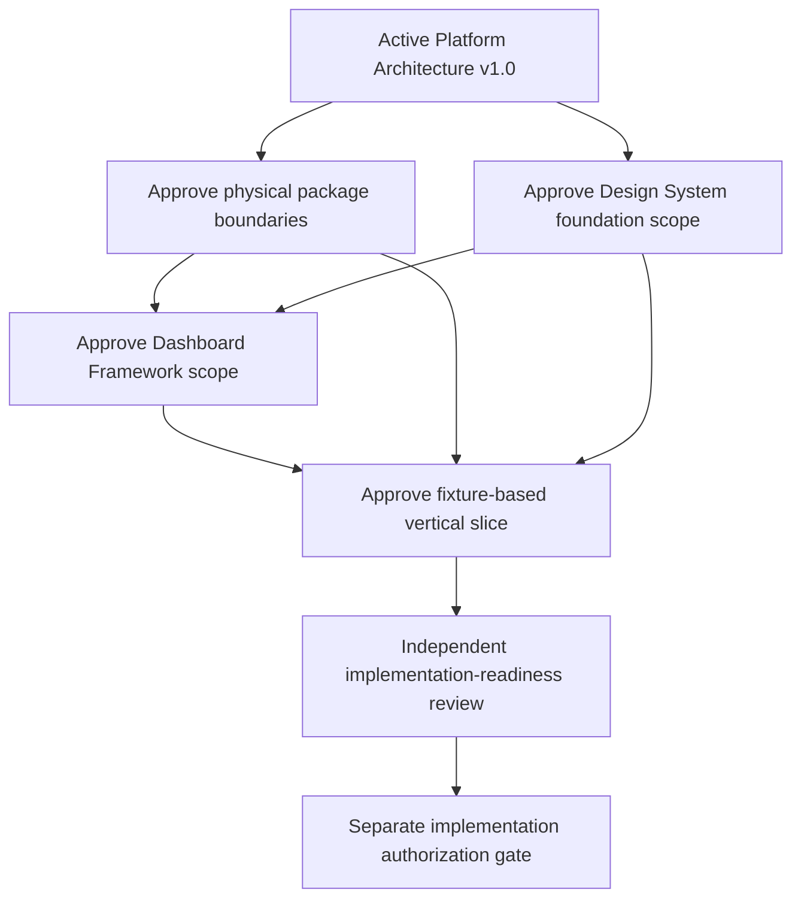

# Platform Implementation Readiness Package

| Field | Value |
|---|---|
| Status | Review |
| Version | 0.1.0 |
| Date | 2026-08-06 |
| Backlog | `ARC-005` |
| Owner | Chief architect |
| Prerequisite | Active [Platform Architecture v1.0](PLATFORM_ARCHITECTURE_V1.md) |
| Decision authority | CTO review |

## Purpose

Provide one approval gate for the four proposals required before Platform implementation planning may begin. This package contains proposals only and grants no authority to create production Dashboard code or live integrations.

## Package Contents

1. [Physical WordPress Package Architecture Proposal](PHYSICAL_WORDPRESS_PACKAGE_ARCHITECTURE_PROPOSAL.md)
2. [Design System Foundation Scope Proposal](../../04_Design/DESIGN_SYSTEM_FOUNDATION_SCOPE_PROPOSAL.md)
3. [Dashboard Framework Scope Proposal](../../01_Product/dashboard/DASHBOARD_FRAMEWORK_SCOPE_PROPOSAL.md)
4. [First Vertical Slice Proposal](FIRST_VERTICAL_SLICE_PROPOSAL.md)

## Dependency Sequence

The physical package and Design System proposals may be reviewed in parallel. Dashboard Framework approval depends on both. The vertical slice depends on all three and remains unimplemented until a separate authorization.

## Recommended Implementation Order

1. approve exact physical packages, namespaces and dependency fitness checks;
2. approve Design System tokens, primitives and evidence matrix;
3. approve Dashboard Framework contracts, states and fixture seams;
4. authorize and build the smallest fixture-based vertical slice;
5. validate the slice against architecture and non-functional budgets;
6. decide whether foundations are promotable, require correction or should be discarded; and
7. request a separate production Dashboard implementation approval.

## Consolidated Acceptance Criteria

- every proposal has one owner, responsibility and explicit exclusions;
- dependency direction remains inward and WordPress remains a host/adapter;
- Dashboard composition cannot own or bypass domain policy;
- Design System scope makes WCAG 2.2 AA and responsive behavior testable;
- the vertical slice is fixture-only and visibly simulated;
- architecture risks and open decisions have owners or required dispositions;
- QA can validate dependency, contract, responsive, accessibility, failure and provenance behavior;
- initial availability, RTO and RPO strengthening triggers remain unchanged;
- no production code, live AI/SCADA, schema, API, authentication or deployment is included; and
- frozen Governance Architecture and approved constitutional documents remain unchanged.

## QA Strategy

Independent QA shall validate document completeness, cross-reference integrity, terminology, responsibility separation, dependency sequence, exclusions and Definition of Done. Before any later implementation, QA plans shall cover automated dependency fitness, unit and contract tests, WordPress adapter tests, accessibility and responsive evidence, performance budgets, security boundaries, observability, simulated-data truthfulness, failure isolation and recovery assumptions.

## Architecture Risks and Open Decisions

| ID | Risk or open decision | Required response |
|---|---|---|
| IR-01 | proposals overlap and create duplicate ownership | use the responsibility map and reject cross-boundary implementation |
| IR-02 | package design hardens before evidence | require a representative slice and dependency tests before promotion |
| IR-03 | Design System and Dashboard evolve separately | make framework acceptance depend on approved primitives |
| IR-04 | fixture data is mistaken for operational truth | require visible simulated state and provenance at every boundary |
| IR-05 | MVP expands into live or production scope | enforce exclusions and a separate authorization gate |
| IR-06 | WordPress becomes domain authority | test core contracts without WordPress runtime |
| IR-07 | initial service levels are treated as permanent | retain mandatory strengthening review triggers |
| IR-08 | deferred identity or data choices block the slice | use explicit temporary ports without choosing production implementations |

Open decisions include exact package paths and tooling, design tokens and breakpoints, widget registration representation, fixture contract, identity/access design, persistence design, visualization library, observability provider and hosting topology. None is silently decided here.

## Definition of Done

The Platform Implementation Readiness Package is complete only when:

- all four proposals are present and internally consistent;
- the dependency sequence and recommended order are approved;
- each acceptance criterion, risk, open decision and exclusion is reviewable;
- independent QA reports no unresolved Critical or Major issue;
- CTO approval is recorded; and
- the package remains a proposal with no production Dashboard or live integration implementation.

Approval permits separate detailed design and implementation authorization work in dependency order. It does not itself authorize code.
