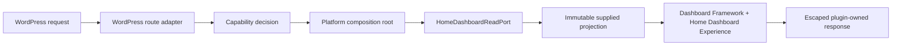

# WordPress Integration Plan

| Field | Value |
|---|---|
| Status | Active / Approved |
| Version | 1.0.0 |
| Date | 2026-08-09 |
| Backlog | `ARC-006` |
| Review authority | CTO and Utility Manager |
| Implementation authorization | Not granted |
| Approval record | Final CTO + Utility Manager approval, PR #45, 2026-08-09 |

## 1. Purpose and boundary

This plan defines how the approved Factory Utility Platform, Dashboard Framework, and Home Dashboard will later be delivered as one WordPress plugin-owned application surface. It is a planning and QA artifact only. It introduces no WordPress route, hook, capability, installation behavior, production configuration, schema, authentication system, or deployment package.

WordPress remains a runtime host and adapter. Domain and Application policy remain independent of WordPress globals, request types, users, roles, options, posts, tables, and lifecycle hooks. The single plugin entry and `FactoryUtility\Platform\Bootstrap\Plugin` remain the only composition root.

## 2. Application surface decision

The planned primary product surface is an **authenticated, plugin-owned frontend application route**, not a screen rendered inside `wp-admin` and not a theme-owned page.

Reasons:

- the Dashboard Experience Shell owns the operational command-center layout without inheriting WordPress admin chrome;
- the route can remain stable across theme changes;
- application navigation, localization, accessibility, responsive behavior, and asset budgets stay under the approved Platform boundary;
- WordPress identity and capability context can still be translated at the adapter boundary;
- future public/reference surfaces and internal operational surfaces can remain separate trust zones.

The WordPress admin surface will provide only an authorized launcher and future plugin configuration/status entry. It shall not duplicate the Home Dashboard, calculate Product state, or become a second application shell.

## 3. Plugin activation and bootstrap

### Activation

The future activation adapter shall:

1. verify the supported PHP and WordPress runtime range before completing activation;
2. register the intended rewrite contract temporarily so rewrite rules can be flushed once;
3. register only versioned plugin metadata and capability definitions approved for the release;
4. avoid creating pages, posts, users, roles, schemas, schedules, or fixture data unless separately authorized;
5. fail safely with an administrator-readable error and no partial activation state.

Activation hooks are lifecycle adapters and shall delegate to a narrow activation service. They shall not boot the full Home Dashboard request path.

### Request bootstrap

The plugin entry loads Composer autoloading and invokes the existing composition root. Bootstrap selects WordPress delivery adapters, localization/presentation adapters, approved projection providers, and the Experience renderer. It registers hooks exactly once and performs no page read, asset enqueue, or projection construction until the matching request is resolved.

Deactivation unregisters runtime behavior and flushes rewrite rules only when necessary. It does not delete Product or user data.

## 4. Route and page registration

The planned canonical route name is `factory_utility_home` with canonical path:

`/factory-utility/`

The WordPress delivery adapter will register a rewrite rule and private query variable, resolve it to the stable route name, perform the capability decision, invoke the application page-read contract, and hand an immutable projection to Experience rendering. WordPress page/post IDs shall not be route identity.

Route behavior:

- canonical pretty permalink: `/factory-utility/`;
- compatibility fallback when pretty permalinks are unavailable: `/?factory_utility_route=home`;
- one canonical redirect may normalize safe alternate forms;
- the plugin emits an application-owned title, canonical URL, appropriate noindex policy until public exposure is separately approved, and correct HTTP status;
- unknown plugin routes return an application-safe 404 without falling through to a misleading Dashboard;
- unavailable dependencies render truthful contained states rather than a WordPress fatal error;
- future Utility routes require separate approved route registrations.

No physical WordPress Page is required. If a future integration needs a Page object for editor/navigation interoperability, that requires a separate migration and ownership decision.

## 5. Home Dashboard delivery sequence



The WordPress adapter may translate request, identity, locale, and response concepts. It shall not calculate Overall Health, alarms, KPIs, freshness, Management Attention priority, representative values, or failure severity.

The first integration implementation remains fixture-only and visibly `SIMULATED`. Fixture adapter selection is allowed only in development/test or an explicitly approved demonstration mode; production configuration shall fail closed rather than silently selecting fixtures.

## 6. Asset loading

Assets are enqueued only for resolved Platform routes or the minimal authorized admin entry. The plugin shall:

- enqueue approved Design System CSS before Dashboard Framework and Home Dashboard CSS;
- use a generated build manifest containing logical name, content hash, version, dependency, and integrity metadata where supported;
- load route JavaScript with `defer` and no inline executable data except a minimal escaped bootstrap configuration;
- avoid external fonts, CDNs, analytics, and runtime package downloads;
- avoid loading Platform assets across unrelated WordPress frontend/admin pages;
- preserve the approved route CSS/JavaScript budgets and record compressed sizes;
- use plugin URLs derived through WordPress APIs only inside the adapter.

Cache invalidation uses the plugin release version or content hash, never current time in production.

## 7. Localization integration

English remains the canonical engineering language. UI locales remain `ko-KR`, `vi-VN`, and `en-US`, with deterministic English fallback.

The localization adapter will resolve preference in this order:

1. approved authenticated user preference when available;
2. replaceable browser/local preference used by the current Shell;
3. supported WordPress user locale;
4. supported WordPress site locale;
5. `en-US` fallback.

WordPress text-domain APIs may load and distribute approved locale resources, but translation keys and resources remain centrally owned by the Platform. PHP and JavaScript resources shall be generated or validated from the same canonical catalogue to prevent drift. Locale selection changes presentation only; route identity, state keys, units, instants, policy, and access decisions remain stable English contracts.

Date/time formatting defaults to `Asia/Ho_Chi_Minh`, preserves source instants/provenance, and does not inherit a conflicting WordPress site timezone as operational truth.

## 8. WordPress admin entry strategy

A top-level or appropriately grouped `Factory Utility Platform` admin menu entry may be registered for authorized administrators. Initial behavior is limited to:

- open the canonical plugin-owned frontend application route;
- show plugin version, environment classification, route availability, and non-sensitive diagnostic status;
- reserve future settings ownership without implementing settings in this gate.

The admin entry shall use capability checks and nonces for any future state-changing action. Merely hiding a menu is not authorization. Dashboard business widgets shall not be duplicated in `wp-admin`.

## 9. Permissions and capability boundary

The planned application capability is the stable adapter-facing key `view_factory_utility_dashboard`. Access is deny-by-default and evaluated before projections are requested or assets containing route bootstrap data are emitted.

- capability keys are stable contracts; WordPress role names are deployment mappings, not Application policy;
- no default role assignment is approved by this plan;
- an implementation fixture may test authorized and denied contexts without creating real users;
- administrators may receive capability-management access only through an approved install policy;
- future Utility-detail, configuration, export, acknowledgement, or control capabilities require separate keys and authorization;
- capability denial returns a safe 403/login handoff appropriate to the selected identity state and reveals no operational projection.

This gate integrates with WordPress identity context; it does not implement a new authentication provider or production role model.

## 10. URL, permalink, and navigation strategy

- stable internal route names remain independent of URLs;
- the RouteResolver maps `factory_utility_home` to the canonical WordPress delivery path;
- Dashboard navigation uses route names and an adapter-generated URL, never hard-coded site origins;
- subdirectory, multisite, HTTPS termination, language preference, and permalink-off installations are covered by contract tests;
- locale does not change the canonical route in v1; language is presentation preference rather than a URL segment;
- WordPress REST endpoints are not required for the first server-rendered integration and require a separate contract if later introduced.

## 11. Install and update strategy

The deployable unit remains one versioned plugin ZIP built from `03_Development/platform`. A repeatable build shall include:

- plugin entry and production Composer autoload files;
- approved `src` packages;
- generated/approved assets and locale resources;
- license/readme and version manifest;
- no tests, fixture screenshots, development caches, local configuration, secrets, source maps containing sensitive paths, or development-only dependencies.

Release packages shall be reproducible, checksummed, scanned, and installed in development then staging before production authorization. The initial update path is controlled upload/deployment of an approved ZIP. Automatic update service selection, signing infrastructure, hosting, and CI/CD implementation remain separate decisions. Updates shall run versioned, idempotent lifecycle steps; this integration introduces no database migration.

Downgrade compatibility is not assumed. Release notes identify minimum WordPress/PHP versions, breaking changes, and rollback compatibility.

## 12. Environment separation

Environment classification is supplied outside version-controlled Product logic and normalized to `development`, `staging`, or `production` by the WordPress adapter.

| Environment | Fixture availability | Diagnostics | Asset mode | Data boundary |
|---|---|---|---|---|
| Development | Allowed and visibly simulated | Detailed, non-secret | Debug or production build | No production data |
| Staging | Explicitly enabled simulated/test sources only | Controlled | Production-equivalent | Sanitized/non-production unless separately governed |
| Production | Disabled by default; fail closed | Minimal/auditable | Versioned production assets | Only separately approved authoritative adapters |

Environment must not be inferred from hostname alone. Production must never fall back to fixtures after provider failure.

## 13. Rollback, deactivation, and uninstall

Rollback is replacement with the last approved compatible plugin ZIP followed by route, asset, capability, localization, and Home Dashboard smoke validation. Rollback triggers include fatal boot, access-control failure, route takeover, asset integrity failure, misleading truth state, or unacceptable performance/security regression.

Deactivation stops hooks/routes/assets and retains data/configuration. Uninstall is non-destructive by default. A future `uninstall.php` may remove only explicitly plugin-owned ephemeral options after a separately approved retention decision. It shall never delete users, roles owned by others, posts, operational records, engineering evidence, or shared data automatically. Because this gate introduces no schema, no schema rollback exists.

## 14. Security design

- validate route/query input against allowlists and reject ambiguous encodings;
- check capability before page read and sensitive rendering;
- use nonces for all future state-changing admin actions; GET rendering remains side-effect free;
- escape HTML, attributes, URLs, JSON, and translated parameters at the output context;
- enforce Content Security Policy compatibility: no `eval`, inline event handlers, remote scripts, or unapproved origins;
- expose correlation identifiers but not stack traces, paths, credentials, source endpoints, or raw provider errors;
- do not cache authorized operational responses in shared/public caches without an approved partitioning policy;
- classify logs and minimize user, plant, and operational data;
- validate package checksums, dependencies, supported runtime, and security advisories before release;
- apply WordPress hardening and OWASP review proportional to the internal operational surface.

## 15. Performance and caching

- unrelated WordPress requests incur no Home Dashboard projection or asset work;
- bootstrap registration remains lightweight and idempotent;
- initial route retains the approved Platform budgets: JavaScript at most 200 KiB compressed and CSS at most 100 KiB compressed, with the stricter component budgets retained;
- server timing records route resolution, authorization, composition, read-port, render, and total duration without sensitive payloads;
- the first fixture integration target is server response p95 at most 500 ms in the documented QA environment, excluding deliberate failure delay;
- browser evidence shall record LCP/CLS and asset transfer sizes in a controlled environment;
- caching may store immutable assets aggressively by content hash; projection caching requires a separate freshness, authorization, partitioning, invalidation, and provenance policy;
- WordPress object/page caches shall not convert stale, unavailable, or simulated data into apparent live truth.

These are implementation acceptance budgets, not production SLAs.

## 16. Deployment package structure

```text
factory-utility-platform/
├── factory-utility-platform.php
├── composer.json
├── vendor/                    # production dependencies/autoload only
├── src/
│   ├── Platform/Bootstrap/
│   ├── Modules/
│   ├── Experience/
│   ├── Adapters/WordPress/
│   ├── Adapters/HomeDashboard/
│   └── Shared/
├── assets/
│   ├── design-system/
│   ├── dashboard-framework/
│   └── home-dashboard/
├── languages/                 # generated WordPress-compatible catalogues
├── build-manifest.json
└── readme.txt
```

The exact generated package is an implementation deliverable. Tests, QA evidence, fixtures, development tools, and repository Governance documents remain outside the production ZIP.

## 17. Test strategy

| Level | Required evidence |
|---|---|
| Unit | route mapping, locale precedence, capability decision translation, environment normalization, manifest lookup |
| Contract | WordPress adapter implements inward ports; projection unchanged; stable route/capability keys |
| Architecture | no WordPress globals/types in Domain/Application; one composition root; no theme ownership |
| Integration | activation/deactivation, rewrite registration/flush count, canonical/fallback URLs, 200/403/404, enqueue isolation, admin launcher |
| Localization | three locales, English fallback, WP/user/browser precedence, Unicode, plant timezone invariance |
| Security | unauthorized request before page read, nonce on mutation fixtures, escaping, CSP, cache headers, error redaction, package audit |
| Performance | unrelated-request overhead, boot/render timing, compressed assets, query count, LCP/CLS in controlled environment |
| Compatibility | supported WordPress/PHP matrix, pretty permalinks on/off, subdirectory, multisite decision test, common cache behavior |
| Lifecycle | clean activation failure, repeat activation/update idempotency, deactivation retention, rollback smoke, non-destructive uninstall |
| Experience | Home Dashboard desktop/mobile, three locales, keyboard/focus, 200% zoom, applicable 400% reflow, VoiceOver, forced colors, reduced motion |
| Packaging | allowlist contents, excluded tests/fixtures/secrets, checksum, clean install, version consistency, reproducible archive |

A disposable WordPress test environment shall be used. Production WordPress integration and deployment are not part of plan validation.

## 18. Architecture fitness rules

Automated checks shall reject:

- WordPress symbols in Domain or Application;
- a second plugin entry/composition root;
- theme-owned Product behavior or tokens;
- direct Home Dashboard access to WordPress globals;
- projection calculations in WordPress adapters or Experience;
- unconditional global asset enqueue;
- production fixture fallback;
- role names used as Application authorization policy;
- hard-coded origins, Page IDs, site paths, credentials, or environments;
- install/update/uninstall behavior that creates or deletes unauthorized data;
- production ZIP contents outside the approved allowlist.

## 19. Planned implementation sequence

1. Approve this integration plan and unresolved product/operations decisions.
2. Add WordPress adapter contracts and test harness without changing Domain/Application.
3. Implement route, access translation, and request composition.
4. Implement route-scoped assets and centralized localization bridge.
5. Add admin launcher and non-sensitive status only.
6. Add lifecycle handlers and reproducible package builder.
7. Execute security, compatibility, lifecycle, accessibility, performance, and packaging validation.
8. Submit a dedicated Draft implementation PR and keep it unmerged until CTO and Utility Manager review.

## 20. Definition of Done for later implementation

The future integration is Done only when:

- the plugin activates, boots, routes, authorizes, localizes, renders, deactivates, and rolls back through tested adapters;
- `/factory-utility/` and fallback URL behave correctly without a WordPress Page dependency;
- Home Dashboard remains fixture-only and visibly simulated for the integration gate;
- unauthorized requests cannot invoke projection reads or expose route data;
- assets load only on owned surfaces and remain within budgets;
- three locales, plant timezone, accessibility, responsive behavior, truthful states, and failure isolation are preserved;
- production fixture fallback is impossible by default;
- package contents, checksums, install/update, rollback, and non-destructive uninstall evidence pass;
- complete tests report zero Critical or Major issue;
- protected Charter/Architecture, Design System, Dashboard Framework, and Home Dashboard domain authority remain unchanged;
- CTO and Utility Manager approve the dedicated implementation PR.

## 21. Explicit exclusions

This plan does not authorize production WordPress integration, live data/adapters, real alarms or KPI formulas, a database schema, external authentication, role assignment, AI/Gemma, CMMS/workflow, notifications, control commands, Utility detail screens, hosting/CDN selection, automatic updater service, CI/CD, production deployment, or destructive uninstall.

## 22. Decisions requested at review

CTO and Utility Manager approval is requested for:

1. plugin-owned authenticated frontend route as the primary application surface;
2. `/factory-utility/` as canonical path with query fallback;
3. WordPress admin as launcher/status boundary, not the Product shell;
4. stable deny-by-default `view_factory_utility_dashboard` capability with role mapping deferred;
5. fixture availability disabled by default in production;
6. non-destructive uninstall and controlled ZIP update/rollback strategy.
